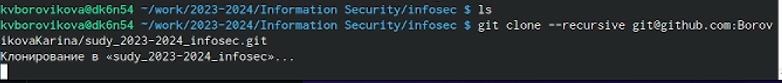
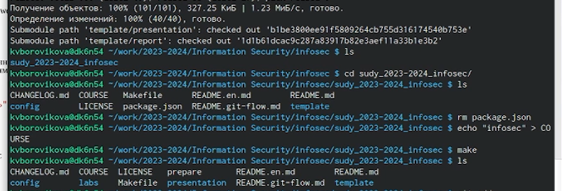
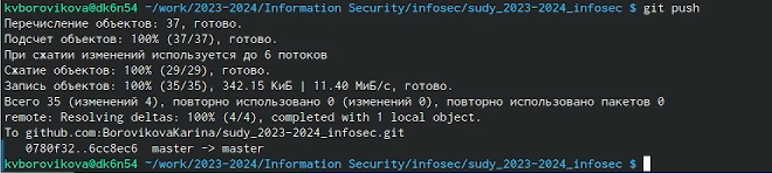
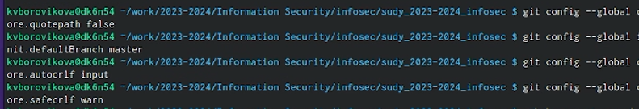
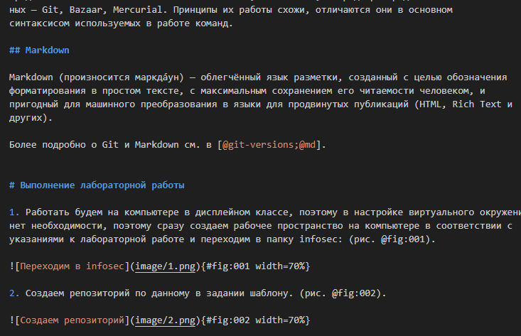

---
## Front matter
lang: ru-RU
title: Презентация для лабораторной работы №1
subtitle: Настройка окружения
author:
  - Кулябов Д. С.
institute:
  - Российский университет дружбы народов, Москва, Россия
date: 09 сентября 2023

## i18n babel
babel-lang: russian
babel-otherlangs: english

## Formatting pdf
toc: false
toc-title: Содержание
slide_level: 2
aspectratio: 169
section-titles: true
theme: metropolis
header-includes:
 - \metroset{progressbar=frametitle,sectionpage=progressbar,numbering=fraction}
 - '\makeatletter'
 - '\beamer@ignorenonframefalse'
 - '\makeatother'
---

# Лабораторная работа №1

# Вводная часть

## Объект и предмет исследования

- Система контроля версий Git
- облегченный язык разметки Markdown
- Рабочее пространство компьютера в дисплейном классе

## Цели и задачи

- Настроить систему Git
- Создать рабочее пространство для лабораторной работы
- Написать отчет на облегченном языке разметки Markdown

# Ход выполнения работы

## Создание рабочего пространства для лабораторной работы

1. Создаем репозиторий по данному в задании шаблону и клонируем созданный нами репозиторий рекурсивно на наш компьютер. (рис. 1-2)

{#fig:001 width=70%}

## Создание рабочего пространства для лабораторной работы

{#fig:002 width=70%}

## Работа с системой Git

1. Пушим изменения на git. (рис. 3)

{#fig:003 width=70%}

2. Продолжаем конфигурировать git. (рис. 4)

{#fig:004 width=70%}

## Работа с Markdown

1. Пишем отчет к лабораторной работе на облегченном языке разметки Markdown. (рис. 5)

{#fig:005 width=70%}

## Результаты

В ходе лабораторной работы нам удалось подготовить пространство для следующих лабораторных работ.