---
## Front matter
title: "Отчет по лабораторной работе №1"
subtitle: "Дисциплина: Информационная безопасность"
author: "Боровикова Карина Владимировна"

## Generic otions
lang: ru-RU
toc-title: "Содержание"

## Bibliography
bibliography: bib/cite.bib
csl: pandoc/csl/gost-r-7-0-5-2008-numeric.csl

## Pdf output format
toc: true # Table of contents
toc-depth: 2
lof: true # List of figures
lot: true # List of tables
fontsize: 12pt
linestretch: 1.5
papersize: a4
documentclass: scrreprt
## I18n polyglossia003-lab_markdown.pdf
polyglossia-lang:
  name: russian
  options:
	- spelling=modern
	- babelshorthands=true
polyglossia-otherlangs:
  name: english
## I18n babel
babel-lang: russian
babel-otherlangs: english
## Fonts
mainfont: PT Serif
romanfont: PT Serif
sansfont: PT Sans
monofont: PT Mono
mainfontoptions: Ligatures=TeX
romanfontoptions: Ligatures=TeX
sansfontoptions: Ligatures=TeX,Scale=MatchLowercase
monofontoptions: Scale=MatchLowercase,Scale=0.9
## Biblatex
biblatex: true
biblio-style: "gost-numeric"
biblatexoptions:
  - parentracker=true
  - backend=biber
  - hyperref=auto
  - language=auto
  - autolang=other*
  - citestyle=gost-numeric
## Pandoc-crossref LaTeX customization
figureTitle: "Рис."
tableTitle: "Таблица"
listingTitle: "Листинг"
lofTitle: "Список иллюстраций"
lotTitle: "Список таблиц"
lolTitle: "Листинги"
## Misc options
indent: true
header-includes:
  - \usepackage{indentfirst}
  - \usepackage{float} # keep figures where there are in the text
  - \floatplacement{figure}{H} # keep figures where there are in the text
---

# Цель работы

Целью данной лабораторной работы является подготовка рабочего пространства для следующих лабораторных работ 

# Задание

- Создать базовую конфигурацию для работы с git.
- Создать ключ SSH.
- Создать ключ PGP.
- Настроить подписи git.
- Зарегистрироваться на Github.
- Создать локальный каталог для выполнения заданий по предмету

# Теоретическое введение

## Системы контроля версий

Системы контроля версий (Version Control System, VCS) применяются при работе несколь-
ких человек над одним проектом. Обычно основное дерево проекта хранится в локальном
или удалённом репозитории, к которому настроен доступ для участников проекта. При
внесении изменений в содержание проекта система контроля версий позволяет их
фиксировать, совмещать изменения, произведённые разными участниками проекта,
производить откат к любой более ранней версии проекта, если это требуется.

В классических системах контроля версий используется централизованная модель,
предполагающая наличие единого репозитория для хранения файлов. Выполнение боль-
шинства функций по управлению версиями осуществляется специальным сервером.

Участник проекта (пользователь) перед началом работы посредством определённых
команд получает нужную ему версию файлов. После внесения изменений, пользователь
размещает новую версию в хранилище. При этом предыдущие версии не удаляются
из центрального хранилища и к ним можно вернуться в любой момент. Сервер может
сохранять не полную версию изменённых файлов, а производить так называемую дельта-
компрессию — сохранять только изменения между последовательными версиями, что
позволяет уменьшить объём хранимых данных.

Системы контроля версий поддерживают возможность отслеживания и разрешения
конфликтов, которые могут возникнуть при работе нескольких человек над одним
файлом. Можно объединить (слить) изменения, сделанные разными участниками (авто-
матически или вручную), вручную выбрать нужную версию, отменить изменения вовсе
или заблокировать файлы для изменения. В зависимости от настроек блокировка не
позволяет другим пользователям получить рабочую копию или препятствует изменению
рабочей копии файла средствами файловой системы ОС, обеспечивая таким образом,
привилегированный доступ только одному пользователю, работающему с файлом.

Системы контроля версий также могут обеспечивать дополнительные, более гибкие
функциональные возможности. Например, они могут поддерживать работу с нескольки-
ми версиями одного файла, сохраняя общую историю изменений до точки ветвления
версий и собственные истории изменений каждой ветви. Кроме того, обычно доступна
информация о том, кто из участников, когда и какие изменения вносил. Обычно такого
рода информация хранится в журнале изменений, доступ к которому можно ограничить.

В отличие от классических, в распределённых системах контроля версий центральный
репозиторий не является обязательным.

Среди классических VCS наиболее известны CVS, Subversion, а среди распределён-
ных — Git, Bazaar, Mercurial. Принципы их работы схожи, отличаются они в основном
синтаксисом используемых в работе команд.

## Markdown 

Markdown (произносится маркда́ун) — облегчённый язык разметки, созданный с целью обозначения форматирования в простом тексте, с максимальным сохранением его читаемости человеком, и пригодный для машинного преобразования в языки для продвинутых публикаций (HTML, Rich Text и других). 

Более подробно о Git и Markdown см. в [@git-versions;@md].

# Выполнение лабораторной работы

1. Работать будем на компьютере в дисплейном классе, поэтому в настройке виртуального окружения нет необходимости, поэтому сразу создаем рабочее пространство на компьютере в соответствии с указаниями к лабораторной работе и переходим в папку infosec: (рис. @fig:001).

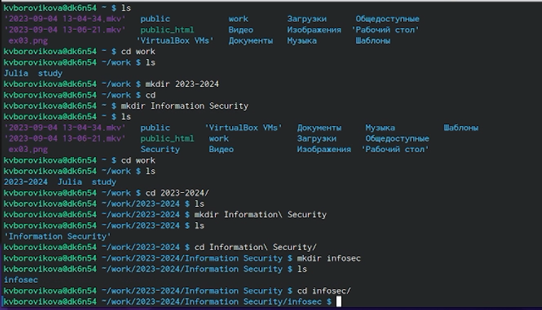{#fig:001 width=70%}

2. Создаем репозиторий по данному в задании шаблону. (рис. @fig:002).

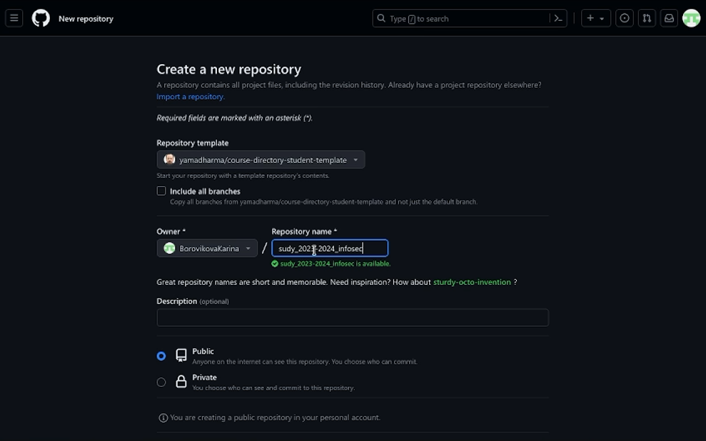{#fig:002 width=70%}

3. Клонируем созданный нами репозиторий рекурсивно на наш компьютер. (рис. @fig:003)

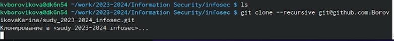{#fig:003 width=70%}

4. Далее переходим в склонированный репозиторий и выполняем действия указанные в лабораторной работе. (рис. @fig:004)
    - yдаляем packaje.json; 
    - в файл COURSE записываем название курса "infosec" 
    - запускаем make и создаем структуру курса 
    
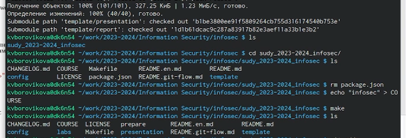{#fig:004 width=70%}

5. Пробуем добавить изменения в индекс и закоммитить изменения, при попытке сделать коммит видим сообщение о том, что мы - неизвестный автор и о том, что коммит не выполнен. (рис. @fig:005)

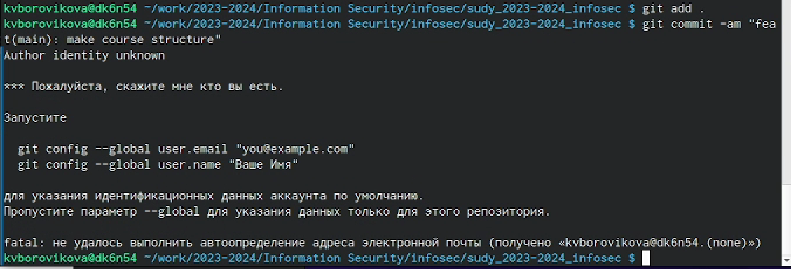{#fig:005 width=70%}

6.  Конфигурируем почту и имя для git. (рис. @fig:006)

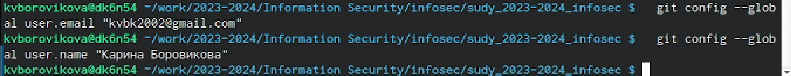{#fig:006 width=70%}

7. Делаем коммит. (рис. @fig:007)

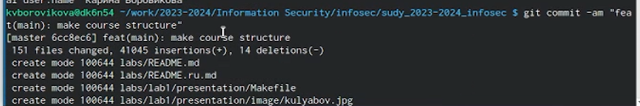{#fig:007 width=70%}

8. Пушим изменения на git. (рис. @fig:008)

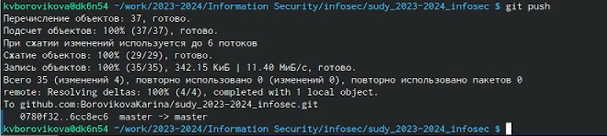{#fig:008 width=70%}

9. Продолжаем конфигурировать git. (рис. @fig:009)

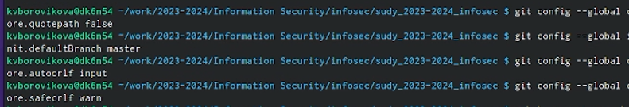{#fig:009 width=70%}

10. Генерируем ключ rsa, видим, что он уже существует, перезапишем и добавим этот ключ на GitHub. (рис. @fig:010)

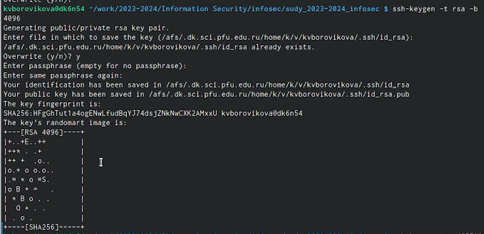{#fig:010 width=70%}

11. Генерируем ключ ed25519, добавляем этот ключ на GitHub. (рис. @fig:011)

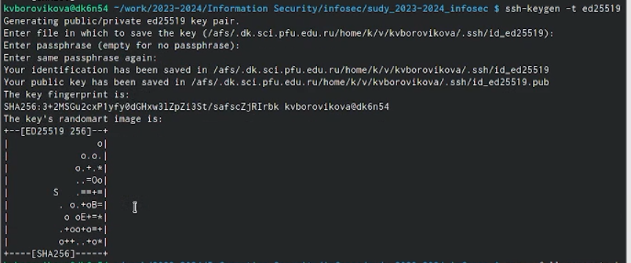{#fig:011 width=70%}

12. Начинаем генерацию ключа gpg. (рис. @fig:012)

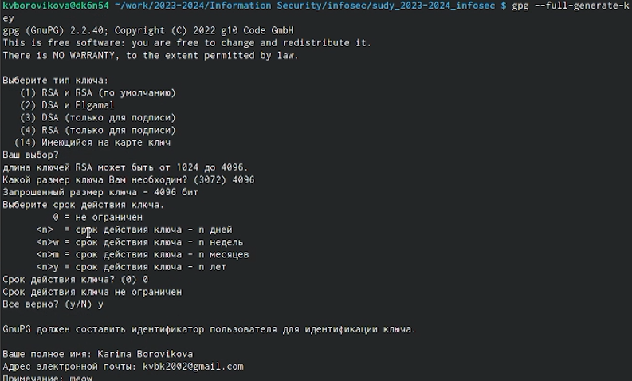{#fig:012 width=70%}

13. Генерация завершена. (рис. @fig:013)

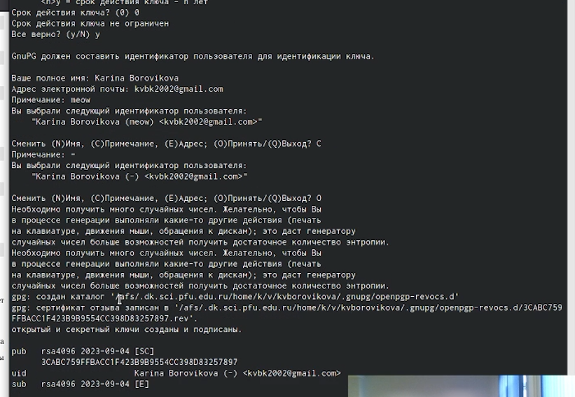{#fig:013 width=70%}

14. Выводим список ключей и копируем отпечаток приватного ключа. Далее копируем ключ в буфер обмена и добавляем на GitHub (рис. @fig:014)

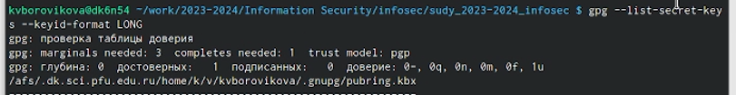{#fig:014 width=70%}

15. Видим, что ключ добавлен на GitHub (рис. @fig:015)

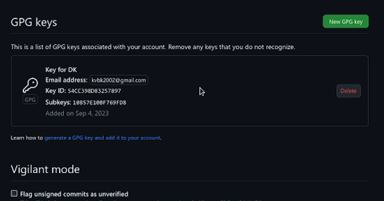{#fig:015 width=70%}

16. Заканчиваем конфигурацию git c помощью gh. (рис. @fig:016)

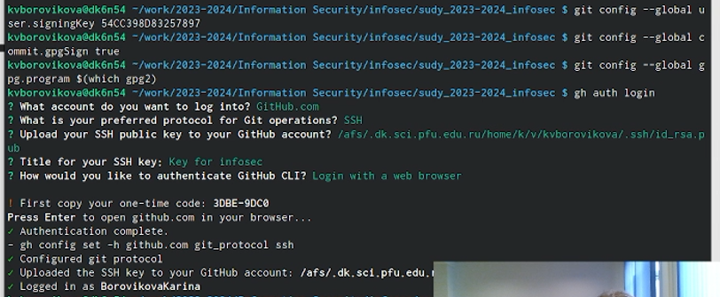{#fig:016 width=70%}

17. Также сделаем некоторые действия из первого файла с настройкой виртуального окружения. (рис. @fig:017)

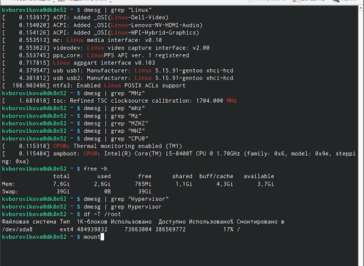{#fig:017 width=70%}

18. Пишем отчет к лабораторной работе на облегченном языке разметки Markdown. (рис. @fig:018)

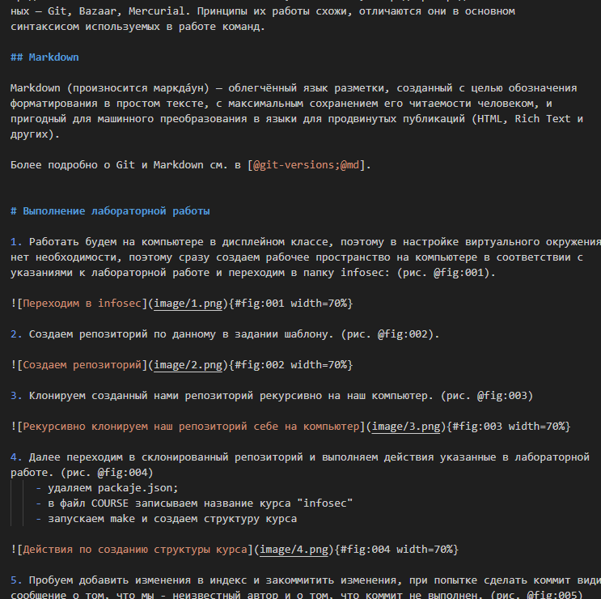{#fig:018 width=70%}

# Выводы

В ходе лабораторной работы нам удалось подготовить пространство для следующих лабораторных работ.

# Список литературы{.unnumbered}

::: {#refs}
:::
