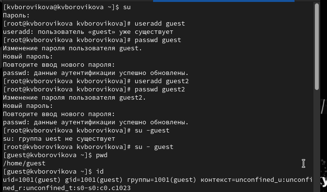
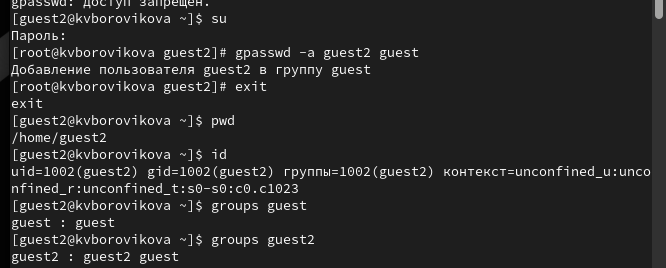
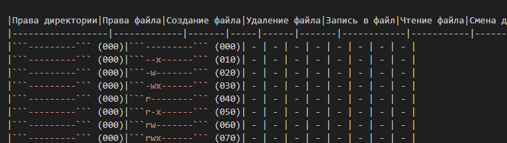

---
## Front matter
lang: ru-RU
title: Презентация для лабораторной работы №3
subtitle: Дискреционное разграничение прав в Linux. Два пользователя

author:
  - Боровикова К. В.
institute:
  - Российский университет дружбы народов, Москва, Россия
date: 23 сентября 2023

## i18n babel
babel-lang: russian
babel-otherlangs: english

## Formatting pdf
toc: false
toc-title: Содержание
slide_level: 2
aspectratio: 169
section-titles: true
theme: metropolis
header-includes:
 - \metroset{progressbar=frametitle,sectionpage=progressbar,numbering=fraction}
 - '\makeatletter'
 - '\beamer@ignorenonframefalse'
 - '\makeatother'
---

# Лабораторная работа №2


# Вводная часть

## Объект и предмет исследования

- Права групп в Linux 
- Работа с терминалом
- Операционная система Linux

## Цели и задачи

- Создать учетную запись guest и guest2
- Провести анализ данных, полученных при выполнении команд
- Составть таблицу, опираясь на полученные данные


# Ход выполнения работы

## Создание учетных записей guest и guest2

Создадим учётную запись пользователя guest, зададим для нее пароль, добавим аналогично второго пользователя guest2, откроем терминал под этим пользователем и посмотрим информацию (рис. 1): ```useradd guest```.

{#fig:001 width=70%}

## Создание учетных записей guest и guest2

Перейдем во второй терминал и проверим информацию о второй учетной записи guest2

{#fig:002 width=70%}

## Составляем таблицу, опираясь на полученные данные

{#fig:003 width=70%}

## Результаты

Получила практические навыки работы в консоли с атрибутами файлов для групп пользователей, закрепила теоретические основы дискреционного разграничения доступа в современных системах с открытым кодом на базе ОС Linux. Заполнила опытным путем таблицы "Установленные права и разрешенные действия" и "Минимальные права для совершения операций".