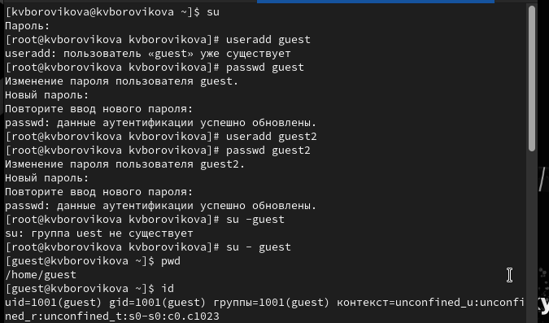
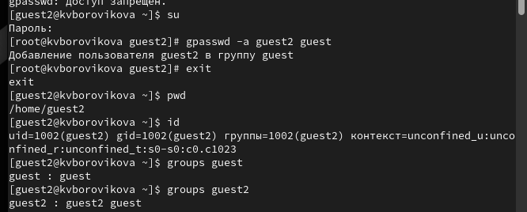
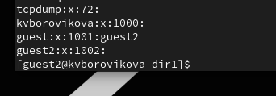
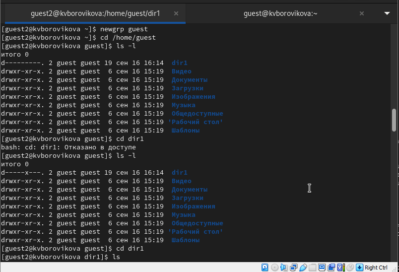
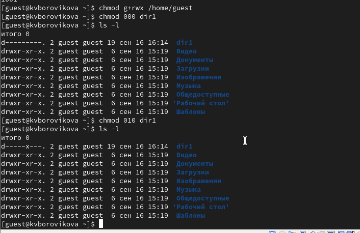

---
## Front matter
title: "Лабораторная работа №3"
subtitle: "Дисциплина: Информационная безопасность"
author: "Боровикова Карина Владимировна"

## Generic otions
lang: ru-RU
toc-title: "Содержание"

## Bibliography
bibliography: bib/cite.bib
csl: pandoc/csl/gost-r-7-0-5-2008-numeric.csl

## Pdf output format
toc: true # Table of contents
toc-depth: 2
lof: true # List of figures
lot: true # List of tables
fontsize: 12pt
linestretch: 1.5
papersize: a4
documentclass: scrreprt
## I18n polyglossia
polyglossia-lang:
  name: russian
  options:
	- spelling=modern
	- babelshorthands=true
polyglossia-otherlangs:
  name: english
## I18n babel
babel-lang: russian
babel-otherlangs: english
## Fonts
mainfont: PT Serif
romanfont: PT Serif
sansfont: PT Sans
monofont: PT Mono
mainfontoptions: Ligatures=TeX
romanfontoptions: Ligatures=TeX
sansfontoptions: Ligatures=TeX,Scale=MatchLowercase
monofontoptions: Scale=MatchLowercase,Scale=0.9
## Biblatex
biblatex: true
biblio-style: "gost-numeric"
biblatexoptions:
  - parentracker=true
  - backend=biber
  - hyperref=auto
  - language=auto
  - autolang=other*
  - citestyle=gost-numeric
## Pandoc-crossref LaTeX customization
figureTitle: "Рис."
tableTitle: "Таблица"
listingTitle: "Листинг"
lofTitle: "Список иллюстраций"
lotTitle: "Список таблиц"
lolTitle: "Листинги"
## Misc options
indent: true
header-includes:
  - \usepackage{indentfirst}
  - \usepackage{float} # keep figures where there are in the text
  - \floatplacement{figure}{H} # keep figures where there are in the text
---

# Цель работы

Получение практических навыков работы в консоли с атрибутами файлов для групп пользователей, закрепление теоретических основ дискреционного разграничения доступа в современных системах с открытым кодом на базе ОС Linux.

# Задание

- Произвести работу в консоли с атрибутами файлов для групп пользователей от имени пользователя *guest* и *guest2*;
- Сотавить опытным путем таблицы "Установленные права и разрешенные действия" и "Минимальные права для совершения операций".

# Теоретическое введение

В данной лабораторной работе нам предстоит поработать с правами доступа файлов и директорий. **Права доступа** определяют, какие действия конкретный пользователь может или не может совершать с определенным файлами и каталогами.

Есть 3 вида разрешений. Они определяют права пользователя на 3 действия: чтение, запись и выполнение. В Linux эти действия обозначаются вот так:

- **r** — read (чтение) — право просматривать содержимое файла;
- **w** — write (запись) — право изменять содержимое файла;
- **x** — execute (выполнение) — право запускать файл, если это программа или скрипт.

У каждого файла есть 3 группы пользователей, для которых можно устанавливать права доступа. 

- **owner** (владелец) — отдельный человек, который владеет файлом. Обычно это тот, кто создал файл, но владельцем можно сделать и кого-то другого.
- **group** (группа) — пользователи с общими заданными правами.
- **others** (другие) — все остальные пользователи, не относящиеся к группе и не являющиеся владельцами.[@01] 

Чтобы увидеть текущие назначения владельца, вы можете использовать команду ```ls -l```. Эта команда показывает пользователя и группу-владельца.

С помощью команды ```ls``` вы можете отобразить владельца файлов в данном каталоге. Иногда может оказаться полезным получить список всех файлов в системе, в которых в качестве владельца указан данный пользователь или группа. Для этого вы можете использовать find. Аргумент find -user может быть использован для этой цели.

Чтобы применить соответствующие разрешения, первое, что нужно учитывать, это владение. Для этого есть команда ```chown```.[@02]

Для того, чтобы позволить обычным пользователям выполнять программы от имени суперпользователя без знания его пароля была придумана такая вещь, как SUID и SGID биты. Рассмотрим эти полномочия подробнее.

- **SUID** - если этот бит установлен, то при выполнении программы, id пользователя, от которого она запущена заменяется на id владельца файла. Фактически, это позволяет обычным пользователям запускать программы от имени суперпользователя;
- **SGID** - этот флаг работает аналогичным образом, только разница в том, что пользователь считается членом группы, с которой связан файл, а не групп, к которым он действительно принадлежит. Если SGID флаг установлен на каталог, все файлы, созданные в нем, будут связаны с группой каталога, а не пользователя. Такое поведение используется для организации общих папок;
- **Sticky-bit** - этот бит тоже используется для создания общих папок. Если он установлен, то пользователи могут только создавать, читать и выполнять файлы, но не могут удалять файлы, принадлежащие другим пользователям.

# Выполнение лабораторной работы

1. В установленной при выполнении предыдущей лабораторной работы операционной системе создадим учётную запись пользователя guest (использую учётную запись администратора) (рис. @fig:001): ```useradd guest```.

{#fig:001 width=70%}

2. Зададим пароль для пользователя guest (использую учётную запись администратора) (рис. @fig:001): ```passwd guest```.

3. Аналогично создадим второго пользователя guest2. (рис. @fig:001): 
```useradd guest2, passwd guest```

4. Добавим пользователя guest2 в группу guest: (рис. @fig:002)
```gpasswd -a guest2 guest``

{#fig:002 width=70%}

5. Осуществим вход в систему от двух пользователей на двух разных консолях: guest на первой консоли и guest2 на второй консоли. (рис. @fig:001 - @fig:002)
```su - guest, su - guest2```

6. Определим директорию, в которой находимся, командой ```pwd```(рис. @fig:001 - @fig:002). Сравним её с приглашением командной строки. В командной строке видим символ ```~```, что свидетельствует о том, что **мы находимся в своей домашней директории.**

7. Уточним имя пользователя, его группу, а также группы, куда входит пользователь, командой ```id``` (рис. @fig:001 - @fig:002). 

Видим следующие данные для пользователя guest: uid = 1001(guest), gid = 1001(guest), groups = 1001(guest).

Видим следующие данные для пользователя guest2: uid = 1002(guest2), gid = 1002(guest), groups = 1002(guest2).

Определите командами ```groups guest``` и ```groups guest2``` (рис. @fig:002), в какие группы входят пользователи guest и guest2. Сравните вывод команды groups с выводом команд ```id -Gn``` и ```id -G.```

Видим, что информация для ```groups guest``` и ```groups guest2``` совпадает с действительностью, для пользователя guest группа guest, для пользователя guest2 группы guest и guest2, так как мы этого пользователя добавили в группу guest. Аналогично, совпадает и для команд ```id -Gn``` и ```id -G.``` (рис. @fig:002 - @fig:003)

{#fig:003 width=70%}

8. Сравним полученную информацию с содержимым файла /etc/group.
Просмотрите файл командой
```
cat /etc/group
```

{#fig:004 width=70%}

Найдем в нем последние 2 записи - записи о пользователях guest и guest2. Данные строки показывают, что для guest gid = 1001 и guest2, что соответствует результатам предыдущих команд.

9. От имени пользователя guest2 выполним регистрацию пользователя guest2 в группе guest командой ```newgrp guest``` (рис. @fig:005)

{#fig:005 width=70%}

10. От имени пользователя guest изменим права директории /home/guest, разрешив все действия для пользователей группы: ```chmod g+rwx /home/guest``` (рис. @fig:006)

{#fig:006 width=70%}


11. От имени пользователя guest снимем с директории /home/guest/dir1 все атрибуты командой ```chmod 000 dirl``` и проверим правильность снятия атрибутов. (рис. @fig:006)

Видим, что теперь на директорию dir1 нет никаких прав.


12. Заполните таблицу «Установленные права и разрешённые действия», выполняя действия от имени владельца директории (файлов), определив опытным путём, какие операции разрешены, а какие нет. Если операция разрешена, занесите в таблицу знак «+», если не разрешена, знак «-».

Для опрделения опытным путем будем использовать следующие действияв соответствие со столбцами таблицы:

- ```cd dir1``` - смена директории;
- ```touch <новый_файл>``` - создание файла;
- ```rm <новый_файл>``` - удаление файла;
- ```ls -l (dir1)``` - просмотр файлов в директории;
- ```echo "test" > <файл_с_установленными_правами>``` - запись в файл;
- ```cat <файл_с_установленными_правами>``` - чтение файла;
- ```mv <файл_с_установленными_правами> <переименование>``` - переименование файла;
- ```chattr <атрибуты> <файл_с_установленными_правами>``` смена атрибутов файла.


Остальные действия можно найти в видеозаписи к лабораторной работе.

Заполненная табл. @tbl:01 краткого описания стандартных каталогов Unix.

: Установленные права и разрешенные действия {#tbl:01}

|Права директории|Права файла|Создание файла|Удаление файла|Запись в файл|Чтение файла|Смена директории|Просмотр файлов директории|Переименование файла|Смена аттрибутов файла|
|------------------|-------------|-------|-----|------|-------|------------|-----------|---------|------------|
|```---------``` (000)|```---------``` (000)| - | - | - | - | - | - | - | - |
|```---------``` (000)|```--x------``` (010)| - | - | - | - | - | - | - | - |
|```---------``` (000)|```-w-------``` (020)| - | - | - | - | - | - | - | - |
|```---------``` (000)|```-wx------``` (030)| - | - | - | - | - | - | - | - |
|```---------``` (000)|```r--------``` (040)| - | - | - | - | - | - | - | - |
|```---------``` (000)|```r-x------``` (050)| - | - | - | - | - | - | - | - |
|```---------``` (000)|```rw-------``` (060)| - | - | - | - | - | - | - | - |
|```---------``` (000)|```rwx------``` (070)| - | - | - | - | - | - | - | - |
|```--x------``` (010)|```--x------``` (010)| - | - | - | - | + | - | - | - |
|```--x------``` (010)|```-w-------``` (020)| - | - | + | - | + | - | - | - |
|```--x------``` (010)|```-wx------``` (030)| - | - | + | - | + | - | - | - |
|```--x------``` (010)|```r--------``` (040)| - | - | - | + | + | - | - | + |
|```--x------``` (010)|```r-x------``` (050)| - | - | - | + | + | - | - | + |
|```--x------``` (010)|```rw-------``` (060)| - | - | + | + | + | - | - | + |
|```--x------``` (010)|```rwx------``` (070)| - | - | + | + | + | - | - | + |
|```--x------``` (010)|```---------``` (000)| - | - | - | - | + | - | - | - |
|```-w-------``` (020)|```---------``` (000)| - | - | - | - | - | - | - | - |
|```-w-------``` (020)|```--x------``` (010)| - | - | - | - | - | - | - | - |
|```-w-------``` (020)|```-w-------``` (020)| - | - | - | - | - | - | - | - |
|```-w-------``` (020)|```-wx------``` (030)| - | - | - | - | - | - | - | - |
|```-w-------``` (020)|```r--------``` (040)| - | - | - | - | - | - | - | - |
|```-w-------``` (020)|```r-x------``` (050)| - | - | - | - | - | - | - | - |
|```-w-------``` (020)|```rw-------``` (060)| - | - | - | - | - | - | - | - |
|```-w-------``` (020)|```rwx------``` (070)| - | - | - | - | - | - | - | - |
|```-wx------``` (030)|```---------``` (000)| + | + | - | - | + | - | + | - |
|```-wx------``` (030)|```--x------``` (010)| + | + | - | - | + | - | + | - |
|```-wx------``` (030)|```-w-------``` (020)| + | + | + | - | + | - | + | - |
|```-wx------``` (030)|```-wx------``` (030)| + | + | + | - | + | - | + | - |
|```-wx------``` (030)|```r--------``` (040)| + | + | - | + | + | - | + | + |
|```-wx------``` (030)|```r-x------``` (050)| + | + | - | + | + | - | + | + |
|```-wx------``` (030)|```rw-------``` (060)| + | + | + | + | + | - | + | + |
|```-wx------``` (030)|```rwx------``` (070)| + | + | + | + | + | - | + | + |
|```r--------``` (040)|```---------``` (000)| - | - | - | - | - | + | - | - |
|```r--------``` (040)|```--x------``` (010)| - | - | - | - | - | + | - | - |
|```r--------``` (040)|```-w-------``` (020)| - | - | - | - | - | + | - | - |
|```r--------``` (040)|```-wx------``` (030)| - | - | - | - | - | + | - | - |
|```r--------``` (040)|```r--------``` (040)| - | - | - | - | - | + | - | - |
|```r--------``` (040)|```r-x------``` (050)| - | - | - | - | - | + | - | - |
|```r--------``` (040)|```rw-------``` (060)| - | - | - | - | - | + | - | - |
|```r--------``` (040)|```rwx------``` (070)| - | - | - | - | - | + | - | - |
|```r-x------``` (050)|```---------``` (000)| - | - | - | - | + | + | - | - |
|```r-x------``` (050)|```--x------``` (010)| - | - | - | - | + | + | - | - |
|```r-x------``` (050)|```-w-------``` (020)| - | - | + | - | + | + | - | - |
|```r-x------``` (050)|```-wx------``` (030)| - | - | + | - | + | + | - | - |
|```r-x------``` (050)|```r--------``` (040)| - | - | - | + | + | + | - | + |
|```r-x------``` (050)|```r-x------``` (050)| - | - | - | + | + | + | - | + |
|```r-x------``` (050)|```rw-------``` (060)| - | - | + | + | + | + | - | + |
|```r-x------``` (050)|```rwx------``` (070)| - | - | + | + | + | + | - | + |
|```rw-------``` (060)|```---------``` (000)| - | - | - | - | - | + | - | - |
|```rw-------``` (060)|```--x------``` (010)| - | - | - | - | - | + | - | - |
|```rw-------``` (060)|```-w-------``` (020)| - | - | - | - | - | + | - | - |
|```rw-------``` (060)|```-wx------``` (030)| - | - | - | - | - | + | - | - |
|```rw-------``` (060)|```r--------``` (040)| - | - | - | - | - | + | - | - |
|```rw-------``` (060)|```r-x------``` (050)| - | - | - | - | - | + | - | - |
|```rw-------``` (060)|```rw-------``` (060)| - | - | - | - | - | + | - | - |
|```rw-------``` (060)|```rwx------``` (070)| - | - | - | - | - | + | - | - |
|```rwx------``` (070)|```---------``` (000)| + | + | - | - | + | + | + | - |
|```rwx------``` (070)|```--x------``` (010)| + | + | - | - | + | + | + | - |
|```rwx------``` (070)|```-w-------``` (020)| + | + | + | - | + | + | + | - |
|```rwx------``` (070)|```-wx------``` (030)| + | + | + | - | + | + | + | - |
|```rwx------``` (070)|```r--------``` (040)| + | + | - | + | + | + | + | + |
|```rwx------``` (070)|```r-x------``` (050)| + | + | - | + | + | + | + | + |
|```rwx------``` (070)|```rw-------``` (060)| + | + | + | + | + | + | + | + |
|```rwx------``` (070)|```rwx------``` (070)| + | + | + | + | + | + | + | + |

15. На основании заполненной таблицы @tbl:01 определите те или иные минимально необходимые права для выполнения операций внутри директории dir1, заполните табл. @tbl:02.

: Минимальные права для совершения операций {#tbl:02}

|Операция                |Минимальные права на директорию|Минимальные права на файл|
|------------------------|-------------------------------|-------------------------|
|Создание файла          |d-wx------(030)                |----------(000)          |
|Удаление файла          |d-wx------(030)                |----------(000)          |
|Чтение файла            |d--x------(010)                |-r--------(040)          |
|Запись в файл           |d--x------(010)                |--w-------(020)          |
|Переименование файла    |d-wx------(030)                |----------(000)          |
|Создание поддиректории  |d-wx------(030)                |----------(000)          |
|Удаление поддиректории  |d-wx------(030)                |----------(000)          |


# Выводы

Получила практические навыки работы в консоли с атрибутами файлов для групп пользователей, закрепила теоретические основы дискреционного разграничения доступа в современных системах с открытым кодом на базе ОС Linux. Заполнила опытным путем таблицы "Установленные права и разрешенные действия" и "Минимальные права для совершения операций".


# Список литературы{.unnumbered}

::: {#refs}
:::
