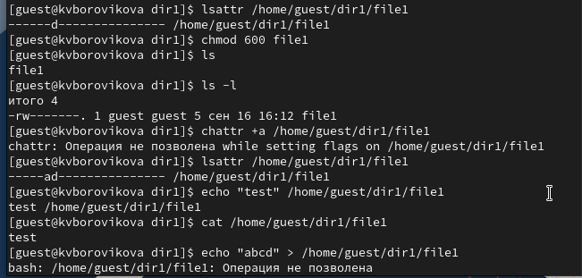

---
## Front matter
lang: ru-RU
title: Презентация для лабораторной работы №4
subtitle: Дискреционное разграничение прав в Linux. Расширенные атрибуты
author:
  - Боровикова К. В.
institute:
  - Российский университет дружбы народов, Москва, Россия
date: 30 сентября 2023

## i18n babel
babel-lang: russian
babel-otherlangs: english

## Formatting pdf
toc: false
toc-title: Содержание
slide_level: 2
aspectratio: 169
section-titles: true
theme: metropolis
header-includes:
 - \metroset{progressbar=frametitle,sectionpage=progressbar,numbering=fraction}
 - '\makeatletter'
 - '\beamer@ignorenonframefalse'
 - '\makeatother'
---

# Лабораторная работа №4

# Вводная часть

## Объект и предмет исследования

- Атрибуты файлов в Linux 
- Работа с терминалом
- Операционная система Linux

## Цели и задачи

- Выполнить команды, указанные в лабораторной работе
- Провести анализ данных, полученных при выполнении команд
- Сделать выводы

# Ход выполнения работы

##  Выполняем команды, указанные в лабораторной работе, анализируя результаты

{#fig:001 width=70%}

##  Выполнить команды, указанные в лабораторной работе, анализируя результаты

{#fig:002 width=70%}

## Результаты

В результате выполнения работы мы повысили свои навыки использования интерфейса командой строки (CLI), познакомились на примерах с тем,
как используются основные и расширенные атрибуты при разграничении
доступа. Имели возможность связать теорию дискреционного разделения
доступа (дискреционная политика безопасности) с её реализацией на практике в ОС Linux. Опробовали действие на практике расширенных атрибутов «а» и «i»