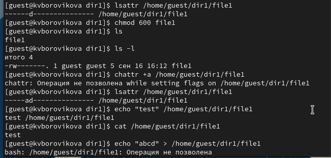
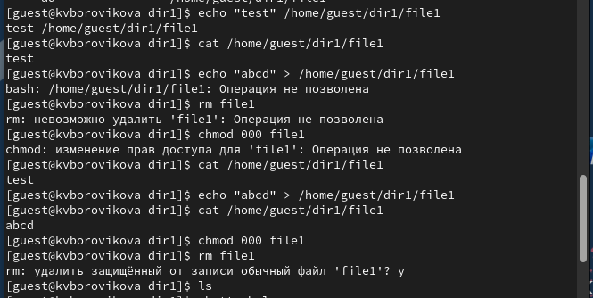
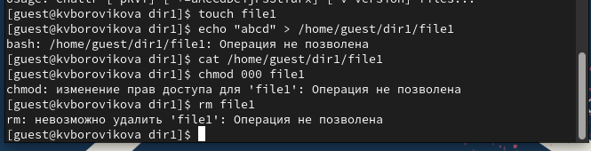

---
## Front matter
title: "Лабораторная работа №4"
subtitle: "Дисциплина: Информационная безопасность"
author: "Боровикова Карина Владимировна"

## Generic otions
lang: ru-RU
toc-title: "Содержание"

## Bibliography
bibliography: bib/cite.bib
csl: pandoc/csl/gost-r-7-0-5-2008-numeric.csl

## Pdf output format
toc: true # Table of contents
toc-depth: 2
lof: true # List of figures
lot: true # List of tables
fontsize: 12pt
linestretch: 1.5
papersize: a4
documentclass: scrreprt
## I18n polyglossia
polyglossia-lang:
  name: russian
  options:
	- spelling=modern
	- babelshorthands=true
polyglossia-otherlangs:
  name: english
## I18n babel
babel-lang: russian
babel-otherlangs: english
## Fonts
mainfont: PT Serif
romanfont: PT Serif
sansfont: PT Sans
monofont: PT Mono
mainfontoptions: Ligatures=TeX
romanfontoptions: Ligatures=TeX
sansfontoptions: Ligatures=TeX,Scale=MatchLowercase
monofontoptions: Scale=MatchLowercase,Scale=0.9
## Biblatex
biblatex: true
biblio-style: "gost-numeric"
biblatexoptions:
  - parentracker=true
  - backend=biber
  - hyperref=auto
  - language=auto
  - autolang=other*
  - citestyle=gost-numeric
## Pandoc-crossref LaTeX customization
figureTitle: "Рис."
tableTitle: "Таблица"
listingTitle: "Листинг"
lofTitle: "Список иллюстраций"
lotTitle: "Список таблиц"
lolTitle: "Листинги"
## Misc options
indent: true
header-includes:
  - \usepackage{indentfirst}
  - \usepackage{float} # keep figures where there are in the text
  - \floatplacement{figure}{H} # keep figures where there are in the text
---

# Цель работы

Получение практических навыков работы в консоли с расширенными атрибутами файлов.

# Задание

- Произвести работу в консоли с атрибутами файлов для пользователей суперпользователя и гостя;
- Опытным путем проверить работу атрибутов "а" и "i".

# Теоретическое введение

В Linux атрибуты файла - это свойства метаданных, которые описывают поведение файла. Например, атрибут может указывать, сжат ли файл, или указывать, можно ли удалить файл. Помимо прав доступа каждый из файлов стандартной файловой системы Linux имеет набор атрибутов, регламентирующих особенности работы с ним. Атрибуты поддерживаются такими файловыми системами Linux, как Ext4, Btrfs и XFS. Команда lsattr позволяет вызывать соответствующую утилиту для их вывода.

Базовый синтаксис команды выглядит следующим образом:

```lsattr [параметры] файлы```

Наиболее важными параметрами являются параметр -R, позволяющий рекурсивно выводить атрибуты файлов в дереве директорий, параметр -a, позволяющий выводить информацию и об атрибутах скрытых файлов и параметр -d, позволяющий выводить информацию об атрибутах директорий вместо обработки их содержимого. В том случае, если утилите не передаются имена файлов, она выводит информацию об атрибутах файлов из текущей директории.

Наиболее важные атрибуты приведены в таблице ниже:

|Атрибут|Значение|
|---------|-----------------|
|A|Запрещает обновлять метку времени доступа к файлу|
|a|Автоматически устанавливает режим дополнения при открытии файла для записи|
|С|Запрещает использовать механизм копирования при записи (Copy-on-Write) при модификации содержимого файла|
|D|При применении к директории активирует режим синхронной записи изменений содержащихся в ней файлов|
|d|Запрещает утилите dump создавать резервную копию файла|
|E|Указывает на ошибку сжатия содержимого файла ядром ОС (не может быть установлен пользователем)|
|e|Указывает на использование экстентов для ссылок на соответствующие файлу дисковые блоки (не может быть установлен пользователем)|
|h|Указывает на то, что размер файла исчисляется в количестве блоков ФС, а не ее секторов, то есть, размер файла превышал или превышает в данный момент 2 ТБ (не может быть установлен пользователем)|
|I|Указывает на то, что содержимое директории было проиндексировано утилитой htree|
|i|Запрещает всем пользователям, в том числе супрепользователю, модифицировать файл, а именно, записывать в него данные, удалять переименовывать или создавать ссылки на него|
|j|Принудительно активирует режим журналирования ФС при записи данных в файл|
|s|Активирует механизм надежного удаления, автоматически записывающий нулевые блоки на диск после удаления файла пользователем|
|S|Активирует режим синхронной записи изменений содержимого файла на диск|
|T|При применении к директории указывает на то, что ее поддиректории не связаны и могут размещаться в отдельных группах блоков|
|t|Запрещает оптимизации использования блоков файла|
|u|Запрещает удаление содержимого файла при его удалении из ФС с целью получения возможности его последующего восстановления|
|X|Указывает на возможность прямого доступа к содержимому сжатого ядром ОС файла (не может быть установлен пользователем)|
|Z|Указывает на неактуальность сжатого ядром ОС файла (не может быть установлен пользователем)|

# Выполнение лабораторной работы

1. От имени пользователя guest определим расширенные атрибуты файла
```/home/guest/dir1/file1``` командой ```lsattr /home/guest/dir1/file1```. (рис. @fig:001)

{#fig:001 width=70%}

2. Установим командой
```chmod 600 file1```
на файл file1 права, разрешающие чтение и запись для владельца файла (рис. @fig:001).

3. Попробуем установить на файл /home/guest/dir1/file1 расширенный атрибут a от имени пользователя guest: ```chattr +a /home/guest/dir1/file1```
В ответ мы получаем отказ от выполнения операции.(рис. @fig:001)

4. Заходим на другую консоль с правами администратора. Установим расширенный атрибут a на файл /home/guest/dir1/file1 от имени суперпользователя: ```chattr +a /home/guest/dir1/file1``` (рис. @fig:002).

{#fig:002 width=70%}


5. От пользователя guest проверим правильность установления атрибута:
```lsattr /home/guest/dir1/file1``` (рис. @fig:001). 

6. Выполним дозапись в файл file1 слова «test» командой
```echo "test" /home/guest/dir1/file1```
После этого выполним чтение файла file1 командой
```cat /home/guest/dir1/file1```
Убедимся, что слово test было успешно записано в file1 (рис. @fig:001).

7. Попробуем удалить файл file1 либо стереть имеющуюся в нём информацию командой ```echo "abcd" > /home/guest/dirl/file1``` Не удалось.
Попробуем переименовать файл командой ```mv file1 file2```.
Так же не удалось (рис. @fig:001).


8. Попробуем с помощью команды
```chmod 000 file1```
установить на файл file1 права, например, запрещающие чтение и запись для владельца файла. 
Указанные выше команды выполнить не удалось, так как атрибут а нам в этом противостоит (рис. @fig:003).

{#fig:003 width=70%}
 

9. Снимем расширенный атрибут a с файла ```/home/guest/dirl/file1``` от
имени суперпользователя командой
```chattr -a /home/guest/dir1/file1```
Повторим операции, которые нам ранее не удавалось выполнить. Видим, что выполнить команды удалось(рис. @fig:002-@fig:003).

10. Повторим наши действия по шагам, заменив атрибут «a» атрибутом «i» (рис. @fig:004).
Выполнить действия не удалось, так как нам мешает атрибут i (рис. @fig:004).

{#fig:004 width=70%}


# Выводы

В результате выполнения работы мы повысили свои навыки использования интерфейса командой строки (CLI), познакомились на примерах с тем,
как используются основные и расширенные атрибуты при разграничении
доступа. Имели возможность связать теорию дискреционного разделения
доступа (дискреционная политика безопасности) с её реализацией на практике в ОС Linux. Опробовали действие на практике расширенных атрибутов «а» и «i».

# Список литературы{.unnumbered}

::: {#refs}
:::
