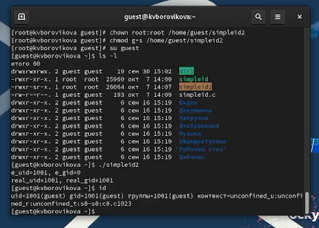

---
## Front matter
lang: ru-RU
title: Презентация для лабораторной работы №5
subtitle:  Дискреционное разграничение прав в Linux. Исследование влияния дополнительных атрибутов

author:
  - Боровикова К. В.
institute:
  - Российский университет дружбы народов, Москва, Россия
date: 7 октября 2023

## i18n babel
babel-lang: russian
babel-otherlangs: english

## Formatting pdf
toc: false
toc-title: Содержание
slide_level: 2
aspectratio: 169
section-titles: true
theme: metropolis
header-includes:
 - \metroset{progressbar=frametitle,sectionpage=progressbar,numbering=fraction}
 - '\makeatletter'
 - '\beamer@ignorenonframefalse'
 - '\makeatother'
---

# Лабораторная работа №5

# Вводная часть

## Объект и предмет исследования

- Права доступа файлов в Linux 
- SetUID, SetGID, Sticky-бит
- Операционная система Linux

## Цели и задачи

- Выполнить команды, указанные в лабораторной работе
- Провести анализ данных, полученных при выполнении команд
- Сделать выводы

# Ход выполнения работы

##  Выполняем команды, указанные в лабораторной работе, анализируя результаты

{#fig:004 width=70%}

##  Выполнить команды, указанные в лабораторной работе, анализируя результаты

{#fig:006 width=70%}

##  Выполнить команды, указанные в лабораторной работе, анализируя результаты

{#fig:007 width=70%}

##  Выполнить команды, указанные в лабораторной работе, анализируя результаты

{#fig:008 width=70%}

##  Выполнить команды, указанные в лабораторной работе, анализируя результаты

{#fig:016 width=70%}

## Результаты

В ходе выполнения лабораторной работы нам удалось изучить механизмы изменения идентификаторов, применения SetUID- и Sticky-битов, получить практические навыки работы в консоли с дополнительными атрибутами, рассмотреть работы механизма смены идентификатора процессов пользователей, а также влияние бита Sticky на запись и удаление файлов.