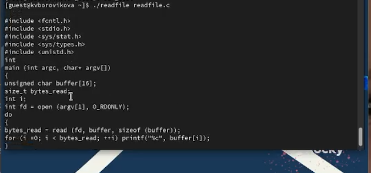

---
## Front matter
title: "Лабораторная работа №5"
subtitle: "Дисциплина: Информационная безопасность"
author: "Боровикова Карина Владимировна"

## Generic otions
lang: ru-RU
toc-title: "Содержание"

## Bibliography
bibliography: bib/cite.bib
csl: pandoc/csl/gost-r-7-0-5-2008-numeric.csl

## Pdf output format
toc: true # Table of contents
toc-depth: 2
lof: true # List of figures
lot: true # List of tables
fontsize: 12pt
linestretch: 1.5
papersize: a4
documentclass: scrreprt
## I18n polyglossia
polyglossia-lang:
  name: russian
  options:
	- spelling=modern
	- babelshorthands=true
polyglossia-otherlangs:
  name: english
## I18n babel
babel-lang: russian
babel-otherlangs: english
## Fonts
mainfont: PT Serif
romanfont: PT Serif
sansfont: PT Sans
monofont: PT Mono
mainfontoptions: Ligatures=TeX
romanfontoptions: Ligatures=TeX
sansfontoptions: Ligatures=TeX,Scale=MatchLowercase
monofontoptions: Scale=MatchLowercase,Scale=0.9
## Biblatex
biblatex: true
biblio-style: "gost-numeric"
biblatexoptions:
  - parentracker=true
  - backend=biber
  - hyperref=auto
  - language=auto
  - autolang=other*
  - citestyle=gost-numeric
## Pandoc-crossref LaTeX customization
figureTitle: "Рис."
tableTitle: "Таблица"
listingTitle: "Листинг"
lofTitle: "Список иллюстраций"
lotTitle: "Список таблиц"
lolTitle: "Листинги"
## Misc options
indent: true
header-includes:
  - \usepackage{indentfirst}
  - \usepackage{float} # keep figures where there are in the text
  - \floatplacement{figure}{H} # keep figures where there are in the text
---

# Цель работы

Изучение механизмов изменения идентификаторов, применения
SetUID- и Sticky-битов. Получение практических навыков работы в консоли с дополнительными атрибутами. Рассмотрение работы механизма
смены идентификатора процессов пользователей, а также влияние бита
Sticky на запись и удаление файлов.

# Задание

- Произвести работу в консоли с учетных записей суперпользователя и гостя;
- Опытным путем проверить работу механизма смены идентификатора процессов пльзователей, а также влияние бита Sticky на запись и удаление файлов.

# Теоретическое введение

Для выполнения четвёртой части задания вам потребуются навыки программирования, а именно, умение компилировать простые программы, написанные на языке С (С++), используя интерфейс CLI.
Само по себе создание программ не относится к теме, по которой выполняется работа, а является вспомогательной частью, позволяющей увидеть, как реализуются на практике те или иные механизмы дискреционного
разграничения доступа. Если при написании (или исправлении существующих) скриптов на bash-e у большинства системных администраторов не
возникает проблем, то процесс компилирования, как показывает практика,
вызывает необоснованные затруднения

# Выполнение лабораторной работы

1. Войдите в систему от имени пользователя guest. (рис. @fig:001)

2. Создайте программу simpleid.c: (рис. @fig:001)
```
#include <sys/types.h>
#include <unistd.h>
#include <stdio.h>
int
main ()
{
uid_t uid = geteuid ();
gid_t gid = getegid ();
printf ("uid=%d, gid=%d\n", uid, gid);
return 0;
}
```

{#fig:001 width=70%}

{#fig:002 width=70%}

3. Скомплилируйте программу и убедитесь, что файл программы создан: (рис. @fig:002)
```gcc simpleid.c -o simpleid```

4. Выполните программу simpleid: (рис. @fig:002)
```./simpleid```

5. Выполните системную программу id: (рис. @fig:002)
```ìd```
видим, что выведенные данные совпадают

6. Усложните программу, добавив вывод действительных идентификаторов: (рис. @fig:003)
```
#include <sys/types.h>
#include <unistd.h>
#include <stdio.h>
int
main ()
{
uid_t real_uid = getuid ();
uid_t e_uid = geteuid ();
gid_t real_gid = getgid ();
gid_t e_gid = getegid () ;
printf ("e_uid=%d, e_gid=%d\n", e_uid, e_gid);
printf ("real_uid=%d, real_gid=%d\n", real_uid, real_gid);
return 0;
}
```
Получившуюся программу назовите simpleid2.c.

7. Скомпилируйте и запустите simpleid2.c: (рис. @fig:003)
```
gcc simpleid2.c -o simpleid2
./simpleid2
```

{#fig:003 width=70%}

8. От имени суперпользователя выполните команды: (рис. @fig:004)

```
chown root:guest /home/guest/simpleid2
chmod u+s /home/guest/simpleid2
```

{#fig:004 width=70%}

9. Используйте sudo или повысьте временно свои права с помощью su.
Данные команды меняют владельца файла и права доступа на него.

10. Выполните проверку правильности установки новых атрибутов и смены
владельца файла simpleid2: (рис. @fig:004)
ls -l simpleid2

11. Запустите simpleid2 и id: (рис. @fig:004 - @fig:005)
./simpleid2
id
Видим, что команды выдали различные данные, e_uid = 0.

{#fig:005 width=70%}


12. Проделайте тоже самое относительно SetGID-бита. (рис. @fig:006)

{#fig:006 width=70%}

Видим, что команды выдали различные данные, e_gid = 0.

13. Создайте программу readfile.c: (рис. @fig:007)

```
#include <fcntl.h>
#include <stdio.h>
#include <sys/stat.h>
#include <sys/types.h>
#include <unistd.h>
int
main (int argc, char* argv[])
{
unsigned char buffer[16];
size_t bytes_read;
int i;
int fd = open (argv[1], O_RDONLY);
do
{
bytes_read = read (fd, buffer, sizeof (buffer));
for (i =0; i < bytes_read; ++i) printf("%c", buffer[i]);
}
while (bytes_read == sizeof (buffer));
close (fd);
return 0;
}
```

{#fig:007 width=70%}


14. Откомпилируйте её. (рис. @fig:008)
```
gcc readfile.c -o readfile
```

15. Смените владельца у файла readfile.c (или любого другого текстового
файла в системе) и измените права так, чтобы только суперпользователь
(root) мог прочитать его, a guest не мог.

{#fig:008 width=70%}

{#fig:009 width=70%}

16. Проверьте, что пользователь guest не может прочитать файл readfile.c. (рис. @fig:009)

17. Смените у программы readfile владельца и установите SetU’D-бит. (рис. @fig:010)

{#fig:010 width=70%}

18. Проверьте, может ли программа readfile прочитать файл readfile.c? (рис. @fig:011)

{#fig:011 width=70%}

19. Проверьте, может ли программа readfile прочитать файл /etc/shadow? (рис. @fig:012)

{#fig:012 width=70%}

Видим, что программа читает файл /etc/shadow

1. Выясните, установлен ли атрибут Sticky на директории /tmp, для чего
выполните команду (рис. @fig:013)
```ls -l / | grep tmp```

Видим, что установлен

2. От имени пользователя guest создайте файл file01.txt в директории /tmp
со словом test:
```
echo "test" > /tmp/file01.txt
```
{#fig:013 width=70%}

3. Просмотрите атрибуты у только что созданного файла и разрешите чтение и запись для категории пользователей «все остальные»: (рис. @fig:014)
```
ls -l /tmp/file01.txt
chmod o+rw /tmp/file01.txt
ls -l /tmp/file01.txt
```


{#fig:014 width=70%}

4. От пользователя guest2 (не являющегося владельцем) попробуйте прочитать файл /tmp/file01.txt: (рис. @fig:015)
```'
cat /tmp/file01.txt
```

5. От пользователя guest2 попробуйте дозаписать в файл
/tmp/file01.txt слово test2 командой (рис. @fig:015)
```echo "test2" > /tmp/file01.txt```
Удалось ли вам выполнить операцию?  нет

6. Проверьте содержимое файла командой (рис. @fig:015)
```cat /tmp/file01.txt```

7. От пользователя guest2 попробуйте записать в файл /tmp/file01.txt
слово test3, стерев при этом всю имеющуюся в файле информацию командой (рис. @fig:015)
```echo "test3" > /tmp/file01.txt```
Удалось ли вам выполнить операцию? нет

8. Проверьте содержимое файла командой (рис. @fig:015)
```cat /tmp/file01.txt```

9. От пользователя guest2 попробуйте удалить файл /tmp/file01.txt командой (рис. @fig:015)
```rm /tmp/fileOl.txt```
Удалось ли вам удалить файл?  нет

{#fig:015 width=70%}

10. Повысьте свои права до суперпользователя следующей командой
su -
и выполните после этого команду, снимающую атрибут t (Sticky-бит) с
директории /tmp: (рис. @fig:016)
```chmod -t /tmp```
11. Покиньте режим суперпользователя командой (рис. @fig:016)
```exit```
12. От пользователя guest2 проверьте, что атрибута t у директории /tmp
нет: (рис. @fig:016)
```ls -l / | grep tmp```
13. Повторите предыдущие шаги. Какие наблюдаются изменения? 
Видим, что нам удалось удалить файл.
(рис. @fig:016)

14. Удалось ли вам удалить файл от имени пользователя, не являющегося
его владельцем? да. (рис. @fig:016)

{#fig:016 width=70%}

15. Повысьте свои права до суперпользователя и верните атрибут t на директорию /tmp: (рис. @fig:017)
```
su -
chmod +t /tmp
exit
```

{#fig:017 width=70%}

# Выводы

В ходе выполнения лабораторной работы нам удалось изучить механизмы изменения идентификаторов, применения SetUID- и Sticky-битов, получить практические навыки работы в консоли с дополнительными атрибутамиб рассмотреть работы механизма смены идентификатора процессов пользователей, а также влияние бита Sticky на запись и удаление файлов.

# Список литературы{.unnumbered}

::: {#refs}
:::
