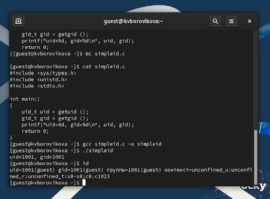

---
## Front matter
title: "Лабораторная работа №6"
subtitle: "Дисциплина: Информационная безопасность"
author: "Боровикова Карина Владимировна"

## Generic otions
lang: ru-RU
toc-title: "Содержание"

## Bibliography
bibliography: bib/cite.bib
csl: pandoc/csl/gost-r-7-0-5-2008-numeric.csl

## Pdf output format
toc: true # Table of contents
toc-depth: 2
lof: true # List of figures
lot: true # List of tables
fontsize: 12pt
linestretch: 1.5
papersize: a4
documentclass: scrreprt
## I18n polyglossia
polyglossia-lang:
  name: russian
  options:
	- spelling=modern
	- babelshorthands=true
polyglossia-otherlangs:
  name: english
## I18n babel
babel-lang: russian
babel-otherlangs: english
## Fonts
mainfont: PT Serif
romanfont: PT Serif
sansfont: PT Sans
monofont: PT Mono
mainfontoptions: Ligatures=TeX
romanfontoptions: Ligatures=TeX
sansfontoptions: Ligatures=TeX,Scale=MatchLowercase
monofontoptions: Scale=MatchLowercase,Scale=0.9
## Biblatex
biblatex: true
biblio-style: "gost-numeric"
biblatexoptions:
  - parentracker=true
  - backend=biber
  - hyperref=auto
  - language=auto
  - autolang=other*
  - citestyle=gost-numeric
## Pandoc-crossref LaTeX customization
figureTitle: "Рис."
tableTitle: "Таблица"
listingTitle: "Листинг"
lofTitle: "Список иллюстраций"
lotTitle: "Список таблиц"
lolTitle: "Листинги"
## Misc options
indent: true
header-includes:
  - \usepackage{indentfirst}
  - \usepackage{float} # keep figures where there are in the text
  - \floatplacement{figure}{H} # keep figures where there are in the text
---

# Цель работы

Развить навыки администрирования ОС Linux. Получить первое практическое знакомство с технологией SELinux1.
Проверить работу SELinx на практике совместно с веб-сервером Apache.

# Задание

- Произвести работу в консоли с учетных записей суперпользователя и гостя;
- Опытным путем проверить работу SELinx на практике совместно с веб-сервером Apache

# Теоретическое введение

Для проведения указанной лабораторной работы на одно рабочее место требуется компьютер с установленной операционной системой Linux,
поддерживающей технологию SELinux.
Предполагается использовать стандартный дистрибутив Linux CentOS
с включённой политикой SELinux targeted и режимом enforcing. Для выполнения заданий требуется наличие учётной записи администратора (root) и
учётной записи обычного пользователя. Постоянно работать от учётной записи root неправильно с точки зрения безопасности.

# Подготовка к выполнению лабораторной работы

Для начала проверим конфигурационный файл SELinux - видим, что политика
targeted и режим enforcing используются в данном дистрибутиве по умолчанию,
т.е. каких-то специальных настроек не требуется (рис. @fig:001).

{#fig:001 width=70%}

Дальше потребуется установить менеджер Apache, для этого предварительно
обновим систему (рис. 4.2), только после этого устанавливаем Apache (httpd) (рис. @fig:002 - @fig:003).

{#fig:002 width=70%}

{#fig:003 width=70%}

Далее зададим ServerName test.ru в конфигурационной файле httpd (рис.
4.6), для этого сперва найдем, где он находитсЯ (риc. @fig:004).

{#fig:004 width=70%}

Чтобы пакетный фильтр в своей рабочей конфигурации позволял подклю10
чаться к 80-у и 81-у портам протокола tcp добавим разрешающие правила (риc. @fig:005):

{#fig:005 width=70%}

# Выполнение лабораторной работы

1. Войдите в систему с полученными учётными данными и убедитесь, что SELinux работает в режиме enforcing политики targeted с помощью команд getenforce и sestatus (риc. @fig:006):

{#fig:006 width=70%}

2. Обратитесь с помощью браузера к веб-серверу, запущенному на вашем
компьютере, и убедитесь, что последний работает:
service httpd status
или
/etc/rc.d/init.d/httpd status
Если не работает, запустите его так же, но с параметром start.
3. Найдите веб-сервер Apache в списке процессов, определите его контекст
безопасности и занесите эту информацию в отчёт. Например, можно использовать команду
ps auxZ | grep httpd
или
ps -eZ | grep httpd
4. Посмотрите текущее состояние переключателей SELinux для Apache с
помощью команды
sestatus -bigrep httpd
Обратите внимание, что многие из них находятся в положении «off».
# Выводы

В ходе выполнения лабораторной работы нам удалось изучить механизмы изменения идентификаторов, применения SetUID- и Sticky-битов, получить практические навыки работы в консоли с дополнительными атрибутамиб рассмотреть работы механизма смены идентификатора процессов пользователей, а также влияние бита Sticky на запись и удаление файлов.

# Список литературы{.unnumbered}

::: {#refs}
:::
