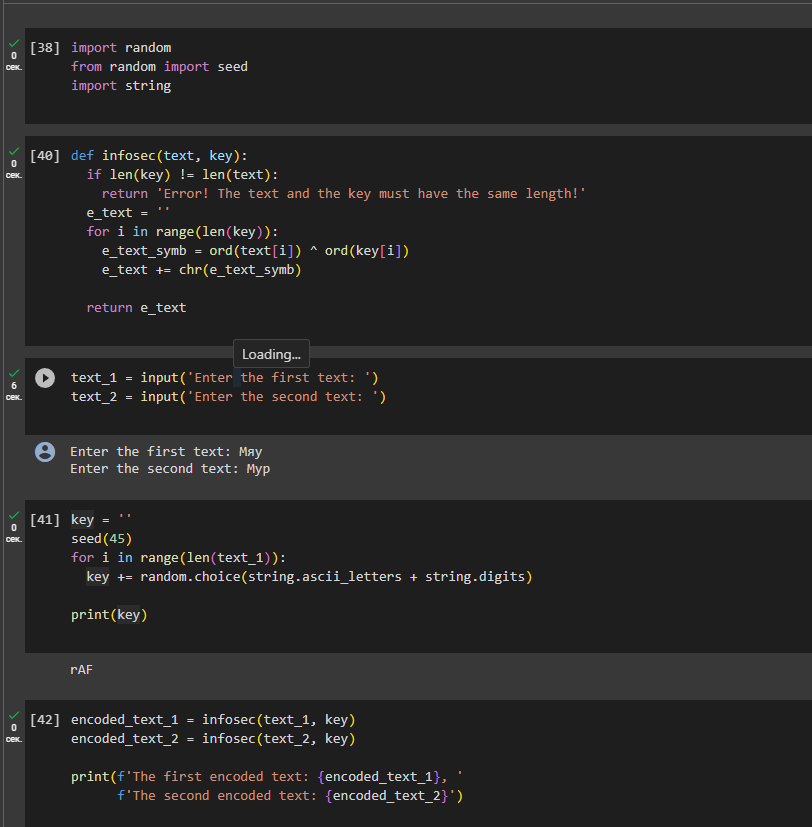
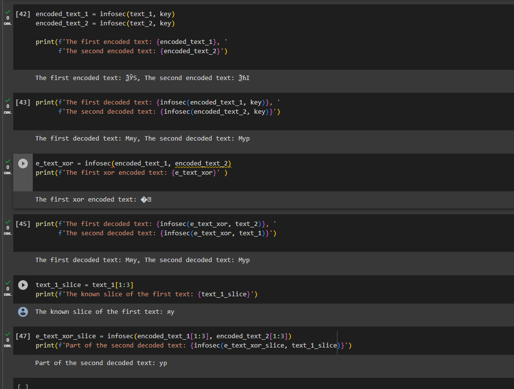

---
## Front matter
lang: ru-RU
title: Презентация для лабораторной работы №8
subtitle: Элементы криптографии. Шифрование (кодирование) различных исходных текстов одним ключом

author:
  - Боровикова К. В.
institute:
  - Российский университет дружбы народов, Москва, Россия
date: 23 сентября 2023

## i18n babel
babel-lang: russian
babel-otherlangs: english

## Formatting pdf
toc: false
toc-title: Содержание
slide_level: 2
aspectratio: 169
section-titles: true
theme: metropolis
header-includes:
 - \metroset{progressbar=frametitle,sectionpage=progressbar,numbering=fraction}
 - '\makeatletter'
 - '\beamer@ignorenonframefalse'
 - '\makeatother'
---

# Лабораторная работа №8

# Вводная часть

## Объект и предмет исследования

- Язык Python 
- Шифрование различных исходных текстов одним ключом

## Цели и задачи

- Написать программу для шифровки и дешифровки текстов
- Произвести работу по шифровке и дешифровке текстов

# Ход выполнения работы

## Пишем код на Python
{#fig:001 width=70%}

## Пишем код на Python

{#fig:002 width=70%}

## Результаты

В ходе выполнения данной лабораторной работы я освоила на практике применение режима однократного гаммирования на примере кодирования различных исходных текстов одним ключом.
