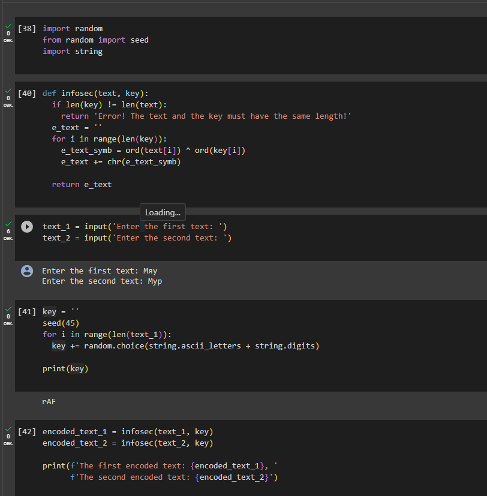
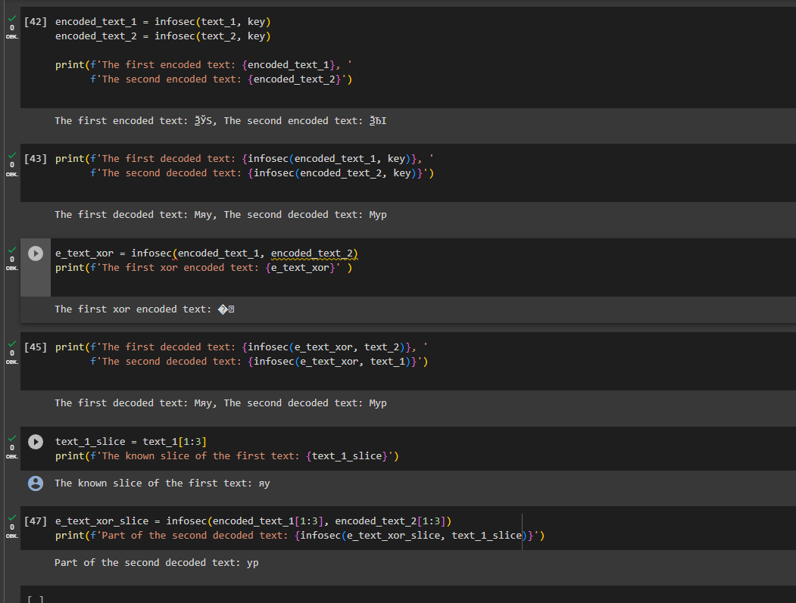

---
## Front matter
title: "Лабораторная работа №8"
subtitle: "Дисциплина: Информационная безопасность"
author: "Боровикова Карина Владимировна"

## Generic otions
lang: ru-RU
toc-title: "Содержание"

## Bibliography
bibliography: bib/cite.bib
csl: pandoc/csl/gost-r-7-0-5-2008-numeric.csl

## Pdf output format
toc: true # Table of contents
toc-depth: 2
lof: true # List of figures
lot: true # List of tables
fontsize: 12pt
linestretch: 1.5
papersize: a4
documentclass: scrreprt
## I18n polyglossia
polyglossia-lang:
  name: russian
  options:
	- spelling=modern
	- babelshorthands=true
polyglossia-otherlangs:
  name: english
## I18n babel
babel-lang: russian
babel-otherlangs: english
## Fonts
mainfont: PT Serif
romanfont: PT Serif
sansfont: PT Sans
monofont: PT Mono
mainfontoptions: Ligatures=TeX
romanfontoptions: Ligatures=TeX
sansfontoptions: Ligatures=TeX,Scale=MatchLowercase
monofontoptions: Scale=MatchLowercase,Scale=0.9
## Biblatex
biblatex: true
biblio-style: "gost-numeric"
biblatexoptions:
  - parentracker=true
  - backend=biber
  - hyperref=auto
  - language=auto
  - autolang=other*
  - citestyle=gost-numeric
## Pandoc-crossref LaTeX customization
figureTitle: "Рис."
tableTitle: "Таблица"
listingTitle: "Листинг"
lofTitle: "Список иллюстраций"
lotTitle: "Список таблиц"
lolTitle: "Листинги"
## Misc options
indent: true
header-includes:
  - \usepackage{indentfirst}
  - \usepackage{float} # keep figures where there are in the text
  - \floatplacement{figure}{H} # keep figures where there are in the text
---

# Цель работы
Освоить на практике применение режима однократного гаммирования на примере кодирования различных исходных текстов одним ключом.

# Задание

- Написать программу для шифровки и дешифровки текстов
- Произвести работу по шифровке и дешифровке текстов

# Теоретическое введение

**Шифрование** – это такое преобразование исходного сообщения, которое не позволит всяким нехорошим людям прочитать данные, если они это сообщение перехватят. 

**Исходное сообщение** – это, собственно, то, что мы хотим зашифровать. Классический пример — текст.

**Шифрованное сообщение** – это сообщение, прошедшее процесс шифрования.

**Шифр** — это сам алгоритм, по которому мы преобразовываем сообщение.

**Ключ** — это компонент, на основе которого можно произвести шифрование или дешифрование.

**Алфавит** – это перечень всех возможных символов в исходном и зашифрованном сообщении. Включая цифры, знаки препинания, пробелы, отдельно строчные и заглавные буквы и т.д.

# Выполнение лабораторной работы

1. Пишем код на языке Python: (риc. @fig:001 - @fig:002):

{#fig:001 width=70%}

- [38]: импорт необходимых библиотек
- [40]: функция, реализующая сложение по модулю два двух строк
- [35]: открытые/исходные тексты (одинаковой длины)
- [41]: создание ключа той же длины, что и открытые тексты
- [42]: получение шифротекстов с помощью функции, созданной ранее, при условии, что известны открытые тексты и ключ
- [43]: получение открытых текстов с помощью функции, созданной ранее, при условии, что известны шифротексты и ключ

{#fig:002 width=70%}

- [44]: сложение по модулю два двух шифротекстов с помощию функции,
созданной ранее
- [45]: получение открытых текстов с помощью функции, созданной ранее,
при условии, что известны оба шифротекста и один из открытых текстов
- [46]: получение части первого открытого текста (срез)
- [47]: получение части второго текста (на тех позициях, на которых расположены символы части первого открытого текста) с помощью функции, созданной ранее, при условии, что известны оба шифротекста и часть первого открытого текста

# Выводы

В ходе выполнения данной лабораторной работы я освоила на практике применение режима однократного гаммирования на примере кодирования различных исходных текстов одним ключом.

# Список литературы{.unnumbered}

::: {#refs}
:::
