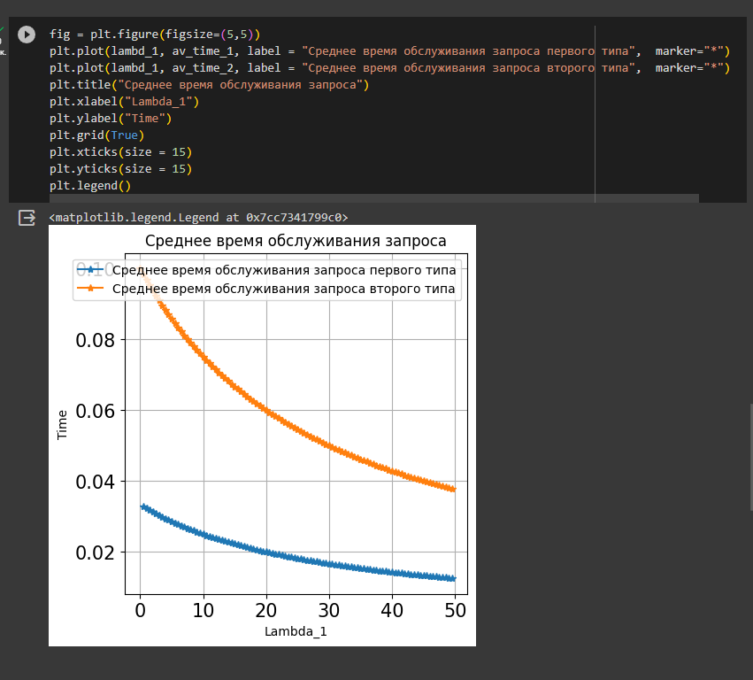

---
## Front matter
title: "Отчет по лабораторной работе №3: Двухсервисная модель с эластичным трафиком"
subtitle: "Дисциплина: Основы проектирования сетей и систем телекоммуникаций"
author: "Выполнила: Боровикова Карина Владимировна, НПИбд-01-20"

## Generic otions
lang: ru-RU
toc-title: "Содержание"

## Bibliography
bibliography: bib/cite.bib
csl: pandoc/csl/gost-r-7-0-5-2008-numeric.csl

## Pdf output format
toc: true # Table of contents
toc-depth: 2
lof: true # List of figures
fontsize: 12pt
linestretch: 1.5
papersize: a4
documentclass: scrreprt
## I18n polyglossia
polyglossia-lang:
  name: russian
  options:
	- spelling=modern
	- babelshorthands=true
polyglossia-otherlangs:
  name: english
## I18n babel
babel-lang: russian
babel-otherlangs: english
## Fonts
mainfont: PT Serif
romanfont: PT Serif
sansfont: PT Sans
monofont: PT Mono
mainfontoptions: Ligatures=TeX
romanfontoptions: Ligatures=TeX
sansfontoptions: Ligatures=TeX,Scale=MatchLowercase
monofontoptions: Scale=MatchLowercase,Scale=0.9
## Biblatex
biblatex: true
biblio-style: "gost-numeric"
biblatexoptions:
  - parentracker=true
  - backend=biber
  - hyperref=auto
  - language=auto
  - autolang=other*
  - citestyle=gost-numeric
## Pandoc-crossref LaTeX customization
figureTitle: "Рис."
tableTitle: "Таблица"
listingTitle: "Листинг"
lofTitle: "Список иллюстраций"
lotTitle: "Список таблиц"
lolTitle: "Листинги"
## Misc options
indent: true
header-includes:
  - \usepackage{indentfirst}
  - \usepackage{float} # keep figures where there are in the text
  - \floatplacement{figure}{H} # keep figures where there are in the text
---

# Теоретические сведения
Проаназируем соту сети емкостью $С$. Пусть пользователи генерируют запросы на передачу данных двух типов. Запросы на передачу данных представляют собой ПП с интенсивностью $λ_i,i = 1,2$. Средняя длина передаваемого файла $θ_i, i =1,2$. Минимальная емкость, необходимая для передачи данных равна 
$b_i, i = 1,2$. 

Основные обозначения:

$C$ - пиковая пропускная способность соты;

$\lambda _i, i = 1, 2$ - интенсивность поступления запросов на предоставление услуги 1, 2-го типа [запросов/ед.вр.];

$\Theta _i, i = 1, 2$ - интенсивность поступления запросов на предоставление услуги 1, 2-го типа [запросов/ед.вр.];

$\rho^1 _i, i = 1, 2$ - интенсивность предложенной нагрузки, создаваемой запросами на предоставление услуги 1, 2-го типа;

_a_ $_i, i=1,2$

$X_i(t), i=1,2$ - число запросов, обслуживаемых в системе в момент времени $t$, $t \geq 0$ 

$X_i(t) = (X_1(t), X_2(t))$ - случайный процесс (СП), описывающий функционирование системы в момент времени $t$, $t \geq 0$;

$X$ - пространство состояний системы;

$n _i, i=1,2$ - число обслуживаемых в системе запросов;

$B_i, i = 1, 2$ - множество блокировок запросов на предоставление услуги 1, 2-го типа;

$S_i, i =1, 2$ - множество приема запросов на предоставление услуги 1, 2-го типа.

Схема модели (рис. [@fig:01]):

{#fig:01 width=40%}

Пространство состояний системы 
([@eq:01]):

$$
X = \left\{(n_1, n_2):n_1 \geq 0, n_2 \geq 0 \right\}
$$ {#eq:01}

Рассмотрим некоторое центральное состояние $(n _1, n _2), (n _1, n _2) ∈ X$. Построим диаграмму интенсивностей переходов для центрального состояния (рис. [@fig:02]): 

{#fig:02 width=70%}

Пояснения:(рис. [@fig:03 - @fig:07])

{#fig:03 width=70%}

{#fig:04 width=70%}

{#fig:05 width=70%}

{#fig:06 width=70%}

{#fig:07 width=70%}

Множество блокировок запросов на передачу данных: ([@eq:02]):
$$
B_i = \left\{ \emptyset \right\}, i = 1,2
$$ {#eq:02}

Множество приема запросов на передачу данных: ([-@eq:03])
$$
S _i = \overline{B _i} = X / B _i = \left\{0, 1, 2, ...\right\}. i= 1, 2
$$ {#eq:03}

Система уравнений глобального баланса (СУГБ) (рис. [@fig:08]):

{#fig:08 width=70%}

Чтобы выписать систему уравнений частичного баланса (СУЧБ), проверим критерий Колмогорова. Рассмотрим произвольный замкнутый контур (рис. [@fig:09])

{#fig:09 width=70%}

Рассмотрим поведение интенсивностей переходов:

- по часовой стрелке: ([@fig:10])

{#fig:10 width=70%}

- против часовой стрелки: ([@fig:11])

{#fig:11 width=70%}

Произведения равны. Критерий выполнен, следовательно СП $(X_1(t), X_2(t))$, описывающий поведение системы является марковским процессом, СУЧБ существует.

СУЧБ:

{#fig:12 width=70%}

Обозначим 

{#fig:13 width=70%}

Стационарное распределение вероятностей системы:

{#fig:14 width=70%}

где

{#fig:15 width=70%}

Основные вероятностные характеристики (ВХ) модели:

- Вероятность блокировки по времени $E_i$ запроса на передачу данных $i$-типа, $i = 1, 2$ ([@eq:05]):

  $$
  E_1 = E_2 = 0;
  $$ {#eq:05}

- Среднее число $\overline{N_i}, i= 1, 2$ обслуживаемых в системе запросов на передачу первого/второго типа([@eq:06]):

  $$
  \overline{N_i} = (\lambda _i) {\Theta \above{1pt} (\Theta _1 \lambda_1 + \Theta _2 \lambda _2)}, i = 1, 2
  $$ {#eq:06}

- Среднее время _T_ $_i, i = 1, 2$ обслуживания запроса на передачу первого/второго типа([@eq:07]):

  $$
  T_i = {\overline{N_i} \above {1pt} \lambda _i}
  $$ {#eq:07}

# Численный анализ

Для расчета основных вероятностных характеристик модели были взяты следующие
параметры ([-@eq:10]):

$$
C = 50, \Theta_1 =10, \Theta_2 = 30,
\lambda_2 = 10, \lambda _1 = \overline{1,C}, шаг = 0.5, n_1 = 30, n_2 = 35
$$ {#eq:10}

Код написан на языке Python и выполнен в среде разработки Google Colab.

{#fig:16 width=80%}

{#fig:17 width=80%}

{#fig:18 width=80%}

{#fig:19 width=80%}

{#fig:20 width=80%}

{#fig:20 width=80%}

{#fig:21 width=80%}

{#fig:22 
width=80%}

